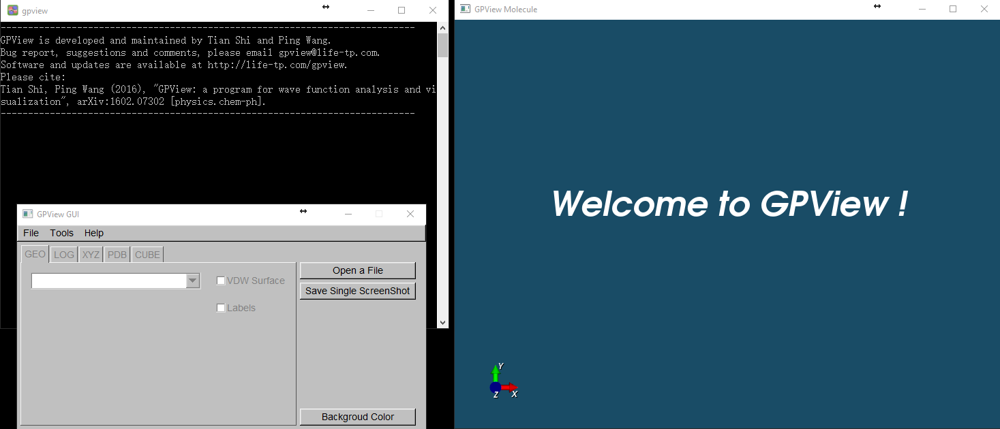
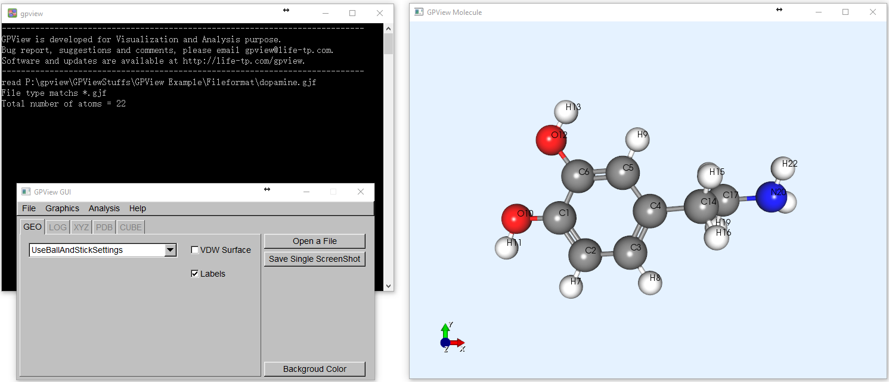
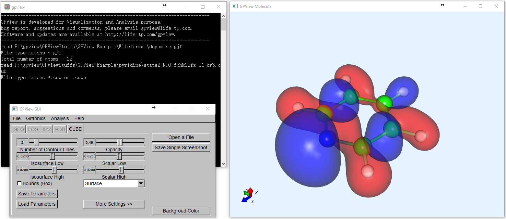
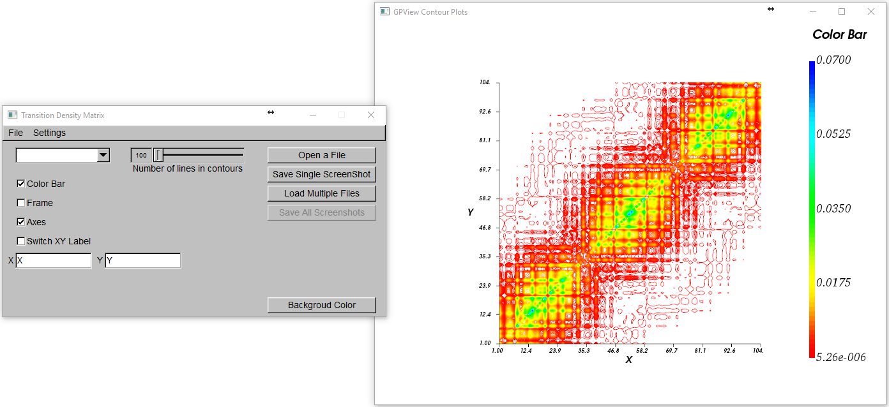

# GPView 
The GPView program is a C++ package for wave function analysis and visualization. It was developed and maintained by Tian Shi and Ping Wang.

Please cite the following paper if you are using GPView:
```
@article{shi2016gpview,
  title={GPView: a program for wave function analysis and visualization},
  author={Shi, Tian and Wang, Ping},
  journal={Journal of Molecular Graphics and Modelling},
  volume={70},
  pages={305--314},
  year={2016},
  publisher={Elsevier}
}
```

## Usuage

### Graphics
- Display molecular structures. GPView can read data from G09 gjf (or com), G09 fchk, G09 wfx, G09 log files, XYZ file, PDB file, and show molecular structures. It can also read molecular structures from input files of GAMESS, MOPAC, Q-chem, Mopro and NWchem.
- Animate single MD trajectories. Structures are from XYZ files.
- Display electronic structures. GPView can read data from CUB (or CUBE) file and display iso-surface for molecular orbitals and electron densities. One can also view a couple of cubes together, which is very convenient for visualizing HOMO-LUMO, Hole-Particle simultaneously.
- Contour Plot and Matrix Color Map, e.g. plot transition density matrices
- Plot Density of States and Spectrum (Oscillator Strength).
- Interface with outputs of GPV-ESMD program, which is a package for Non-Adiabatic Excited-State MD, and simulate the results of single MD trajectories, including molecular structures, potential energy surfaces, non-adibatic coupling terms, hopping probability and bond lengths. It can plot the average state populations as well.

### Analysis
- Extract matrices from rwf dumped files.
- Read parameters from fchk files, calculate various types of orbitals and generate wfx files.
- Read parameters from wfx files, calculate orbitals and density, and generate cube files.
- Calculate charge transfer number matrices from transition density matrices.
- Calculate contracted transition density matrices from transition density matrices.
- Calculate Mulliken bond order.
- Calculate Wiberg bond order, and total and free valences.
- Calculate Mayer bond order, and total and free valences.
- Generate Molecular Orbitals (Restricted Closed Shell, Restricted Open Shell, Unrestricted).
- Generate Total SCF density (Alpha, Beta, Total, Spin).
- Generate Gradient Norm Density.
- Generate Laplacian of Electron Density.
- Generate Natural Orbitals.
- Generate Natural Transition Orbitals (NTO).
- Calculate NTO participation ratio.
- Generate Hole-Particle and Transition Density.
- Generate Natural Difference Orbitals.
- Generate Detachment and Attachment Density.
- Calculations based on cube elements directly, such as taking sum, difference, square and scale.

### Output Figures and Videos
- Save the screenshots to PNG files.
- Save the MD animations to AVI files.
- PNG->AVI conversion.

## Installation instructions
### Windows

Installation and Uninstallation are both very easy.

- GPView is installed in C:\\\\ by default. You can’t change the directory actually. You just need to follow the instruction of installer.
- GPView will not affect anything out of C:\\\\GPView directory.
- To uninstall it, click uninstall.exe in the GPView folder. Alternately, you can go to feature and application to uninstall it.

### MacOS

- Download the GPView.dmg file.
- Install GPView.
- Open a terminal and copy the libraries in the /Applications/GPView/Libraries/* directory to /usr/local/lib. You can run:
 
    ```
    cd /Applications/GPView/Libraries/
    sudo cp *vtk* /usr/local/lib
    sudo cp *arma* /usr/local/lib
    ```

You are ready to use GPView. 

- If you want to uninstall GPView, you can delete the GPView folder in Applications and also you need to remove the shared libraries. You can run
    
    ```
    sudo rm /usr/local/lib/*vtk*
    sudo rm /usr/local/lib/*arma*
    ```
    
- You can also open GPView by running

    ```
    cd /Applications/GPView/gpview.app/Contents/MacOS/
    ./gpview
    ```

Note: We developed GPView in Windows system and we are not sure if the Mac version works propers. If you experience any bug, please contact tshi@vt.edu.

# Demos

<p align="left">
  
</p>
<p align="left">
  
</p>
<p align="left">
  
</p>
<p align="left">
  
</p>

